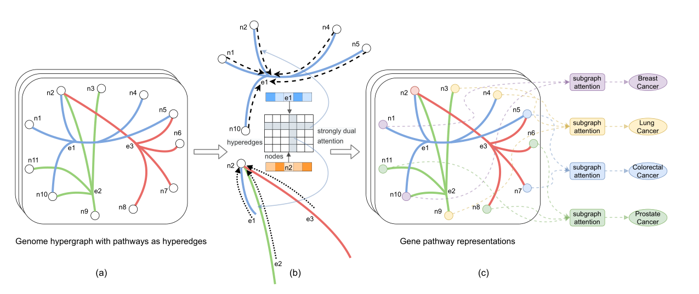

> SHINE: SubHypergraph Inductive Neural nEtwork（子超图归纳神经网络）
>
> NeurIPS 2022 （**人工智能领域顶会**）
>
> 论文：https://openreview.net/forum?id=IsHRUzXPqhI
>
> 代码：https://githubfast.com/luoyuanlab/SHINE

领域：基因遗传学（遗传途径或基因集编码由多个基因驱动的分子功能，自然地表示为超边）

方法：使用**超图神经网络**进行建模。SHINE 使用信息遗传通路将分子功能编码为超边，将基因连接为节点。

**痛点**：现有的超图神经网络模型通常侧重于节点级或图级推理。在实际应用中仍无法**学习超图子图的有效表示**。

# 简介

**动机**：超图引导嵌入可以捕获学习表示中的函数关系

**现有方法**：

现有的超图神经网络模型通常采用半监督学习 (SSL) 范式将标签分配给超图中最初未标记的节点

- 节点级和图级表示给出了图的局部视图或总体视图，即在超图拓扑结构的两个极端。
- 仍然不能学习超图中**子图**的强大表示

本文工作：**SHINE** 的新框架——可以使用学习到的表示对具有固定大小或可变大小的子图进行预测

- 第一个有效**学习**超图子图表示、**使用**学习到的表示进行**归纳推断表示**（对于已见子图）和**下游子图预测**（对于未见子图）的模型。
- SHINE 在各种最先进的基线基础上显著提高了性能
- 同时学习节点和超边的表示。这带来了解释优势

# 相关工作

图表示学习：推荐书籍《Graph representation learning》

超图嵌入：目前仍是新兴领域

子图表示学习和预测：超图主要基于团扩展和二分扩展（超边认为是另一种节点）

——没有一种方法考虑**超图的子图推理和预测**

# 方法

- 开发了一种强烈的双重注意消息传递算法来在节点和超边之间以及跨层传播信息
- 开发了一种加权子图注意机制，通过集成超图节点的表示来学习子图表示

> 收集遗传基因通路——数据集来源

## 超图学习框架

模型：

- 将基因建模为超图节点，即 N = {g1, .. ., g|N |}，通路作为超边，即 E = {p1, ..., p|E|}
- 超图的拓扑结构可以表示为 |N | × |E|关联矩阵 H（0-1矩阵）
- 一条超边伴随着一个 d 维节点特征/嵌入矩阵 N ∈ R|N |×d，每一行对应一个节点的特征/嵌入

特征示例：一条通路可以包含多个基因，但一个基因也可以影响多个通路（点和边互相多对多）

## 强烈双重注意消息传递

1. 节点上的超边注意

$$
a_E\left(p_j, g_i\right)=\exp \left(\mathbf{c}^T \mathbf{s}\left(p_j, g_i\right)\right) /\left(\sum_{g_{i^{\prime}} \in p_j} \exp \left(\mathbf{c}^T \mathbf{s}\left(p_j, g_{i^{\prime}}\right)\right)\right)
$$

其中 c 是可训练的上下文向量，超边节点对 (pj, gi) 的注意力就绪状态 s(pj, gi) 是从第 (k − 1) 层计算的，如下所示
$$
\mathbf{s}\left(p_j, g_i\right)=\operatorname{LeakyReLU}\left(\left(\mathbf{W}_N \mathbf{h}_N^{k-1}\left(g_i\right)+\mathbf{b}_N\right) *\left(\mathbf{W}_E \mathbf{h}_E^{k-1}\left(p_j\right)+\mathbf{b}_E\right)\right)
$$

$$
\mathbf{h}_E^k\left(p_j\right)=\sigma\left(\sum_{g_i \in p_j} a_E\left(p_j, g_i\right) \mathbf{h}_N^{k-1}\left(g_i\right)\right)
$$

2. 超边上的节点注意

$$
a_N\left(g_i, p_j\right)=\exp \left(\mathbf{c}^T \mathbf{s}\left(p_j, g_i\right)\right) /\left(\sum_{p_{j^{\prime}} \ni g_i} \exp \left(\mathbf{c}^T \mathbf{s}\left(p_{j^{\prime}}, g_i\right)\right)\right)
$$

$$
\mathbf{h}_N^k\left(g_i\right)=\sigma\left(\sum_{p_j \ni g_i} a_N\left(g_i, p_j\right) \mathbf{h}_E^{k-1}\left(p_j\right)\right)
$$

3. 超图正则化

## 加权子图注意力

## 子图的归纳分类

# 结论

SHINE框架：用于对超图进行归纳子图推理，旨在联合优化端到端子图分类和相似性正则化的目标，以表示具有相似超边上下文的超图节点

1. 改进了学习模型的**性能**，用于预测具有**不同特征和不同设置**（例如，多类和/或多标签）的复杂（> 20 类）遗传医学数据集的疾病类型.遗传途径直接对应于分子机制和功能
2. 作为子图推理问题的疾病分类的新表述允许超图神经网络将相关途径（即相互作用的分子机制）与疾病病因学联系起来。这会带来更好的性能并增加**可解释性**
3. 在每项疾病分类和癌症分类任务中，SHINE 始终显着优于所有最先进的基线

